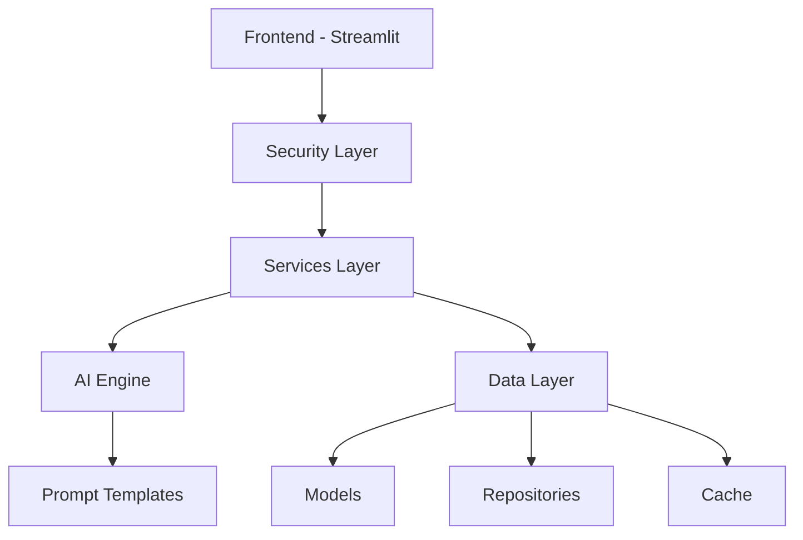
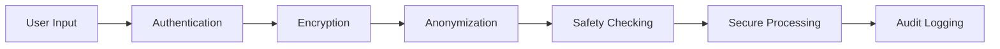

# SafeSpace

<div align="center">
  

  <!-- Badges -->


  <h3>A Digital Mental Health Companion for Students</h3>

  <p align="center">
    <a href="#overview">Overview</a> •
    <a href="#features">Features</a> •
    <a href="#architecture">Architecture</a> •
    <a href="#roadmap">Roadmap</a> •
    <a href="#contributing">Contributing</a> •
    <a href="#security">Security</a>
  </p>
</div>

> [!IMPORTANT]  
> This README is a placeholder and will be updated as development progresses. The repository is currently in pre-development phase.

> [!WARNING]
> SafeSpace is not a replacement for professional mental health services. If you're experiencing a mental health emergency, please contact your local crisis hotline or emergency services immediately.

## Overview

### Vision
SafeSpace is a digital mental health companion that combines AI empathy with human understanding to ensure no student ever has to face their emotional struggles alone.

### Technical Stack


## Features

<table>
  <tr>
    <th>Feature</th>
    <th>Status</th>
    <th>Description</th>
  </tr>
  <tr>
    <td>Supportive Chat Interface</td>
    <td></td>
    <td>AI-powered empathetic conversation with comprehensive safety checks</td>
  </tr>
  <tr>
    <td>Guided Journaling</td>
    <td></td>
    <td>Structured self-reflection with AI-assisted prompts and analysis</td>
  </tr>
  <tr>
    <td>Community Platform</td>
    <td></td>
    <td>Moderated peer support system with anonymity protection</td>
  </tr>
  <tr>
    <td>Crisis Resources</td>
    <td></td>
    <td>Integrated emergency services access with proactive risk assessment</td>
  </tr>
</table>

## Architecture

### Security-First Design


### Core Components
- **Frontend**: 
  - Streamlit-based interface
  - Modular components for chat, journaling, and community
  - Responsive design with crisis resources
- **Security Layer**:
  - Authentication and encryption
  - Anonymization services
  - Compliance monitoring
  - Audit logging
- **AI Engine**:
  - LLM management system
  - Context-aware processing
  - Safety checking pipeline
  - Sentiment analysis
- **Services Layer**:
  - Chat service with message handling
  - Journal service with prompt generation
  - Community service with moderation
  - Analytics with risk assessment
- **Data Layer**:
  - Structured data models
  - Efficient repositories
  - Cache management
  - Database migrations

## Development Setup

### Prerequisites (Planned)
```plaintext
Python >= 3.9
Streamlit >= 1.0.0
Ollama >= 0.1.0
```

### Getting Started
1. Clone the repository:
   ```bash
   git clone https://github.com/yourusername/safespace.git
   cd safespace
   ```

2. Create a virtual environment:
   ```bash
   python -m venv venv
   ```

3. Activate the virtual environment:
   - Windows: 
     ```bash
     .\venv\Scripts\activate
     ```
   - Unix/macOS:
     ```bash
     source venv/bin/activate
     ```

4. Install dependencies:
   ```bash
   pip install -r requirements.txt
   ```

5. Configure environment:
   ```bash
   cp config/.env.example .env
   # Edit .env with your configurations
   ```

## Security

### Core Security Features
- End-to-end encryption
- User authentication system
- Data anonymization
- Security audit logging
- Compliance monitoring

### Compliance Targets
- HIPAA compatibility
- GDPR compliance
- CCPA compliance
- SOC 2 certification

## Testing

The project includes comprehensive testing:
- Unit tests for core services
- Integration tests for AI pipeline
- Security-specific test suite
- User flow testing

## Contributing

> [!NOTE]
> While we're not yet accepting contributions, we have established a structured contribution framework for when we open the project for community involvement.

See [Contributing](app/docs/CONTRIBUTING.md) and the [Code of Conduct](app/docs/CONTRIBUTING.md) for detailed guidelines.

## Documentation

Find detailed documentation in the [`/docs`](app/docs/) directory:
- [Security](app/docs/SECURITY.md): Security practices
- [Contributing](app/docs/CONTRIBUTING.md): Contribution guidelines
- [Code of Conduct](app/docs/CONTRIBUTING.md): Community standards

## License
Pending. Will be updated before initial release.

## Contact

<div align="center">
  
  
  
  
  
</div>

---

<div align="center">
  <sub>Built with ❤️ for student mental health</sub>
</div>