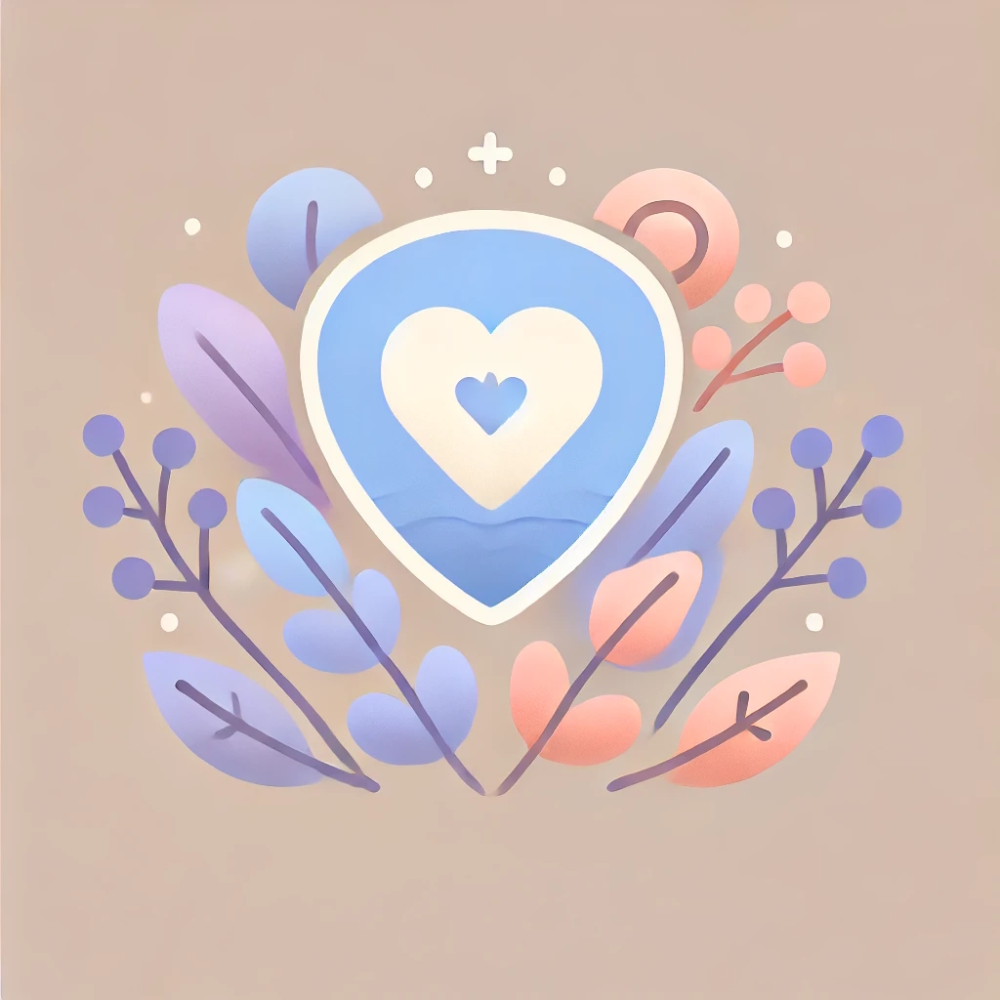

# SafeSpace

  

  <!-- Badges -->
  
  
  
  
  
  
  <h3>A Digital Mental Health Companion for Students</h3>

  

    <a href="#overview">Overview</a> •
    <a href="#features">Features</a> •
    <a href="#architecture">Architecture</a> •
    <a href="#roadmap">Roadmap</a> •
    <a href="#contributing">Contributing</a> •
    <a href="#security">Security</a>
  

> [!IMPORTANT]  
> This README is a placeholder and will be updated once the initial application is built. The repository is currently in pre-development phase.

> [!WARNING]
> SafeSpace is not a replacement for professional mental health services. If you're experiencing a mental health emergency, please contact your local crisis hotline or emergency services immediately.

## Overview

### Vision
I am creating SafeSpace, a digital mental health companion that combines AI empathy with human understanding to ensure no student ever has to face their emotional struggles alone.

### Technical Stack

## Features

<table>
  <tr>
    <th>Feature</th>
    <th>Status</th>
    <th>Description</th>
  </tr>
  <tr>
    <td>AI Therapy Chatbot</td>
    <td></td>
    <td>LLM-powered empathetic conversation with privacy-first design</td>
  </tr>
  <tr>
    <td>Guided Journaling</td>
    <td></td>
    <td>AI-assisted journaling with emotional intelligence</td>
  </tr>
  <tr>
    <td>Anonymous Community</td>
    <td></td>
    <td>Safe, moderated space for peer support</td>
  </tr>
  <tr>
    <td>Crisis Integration</td>
    <td></td>
    <td>Emergency services connection with user consent</td>
  </tr>
</table>

## Architecture

### Security-First Design

### Core Components
- **Frontend**: React.js with TypeScript
- **Backend**: Node.js microservices
- **AI Engine**: TensorFlow/PyTorch
- **Database**: PostgreSQL with encryption
- **Security**: End-to-end encryption, Zero-knowledge architecture

## Development Setup

> [!NOTE]
> Setup instructions will be provided once initial development begins.

Prerequisites (Planned)

- Node.js ≥ 18.0.0
- Docker
- PostgreSQL
- Python 3.9+
- TensorFlow 2.x

## Security

### Priorities
- End-to-end encryption
- Zero-knowledge architecture
- Anonymous profiles
- Secure data handling
- Regular security audits

### Compliance Targets
- HIPAA compatibility
- GDPR compliance
- CCPA compliance
- SOC 2 certification

## Contributing

> [!NOTE]
> While we're not yet accepting contributions, we're planning to open the project for community involvement soon.

### Planned Contribution Process
1. Fork the repository
2. Create a feature branch
3. Commit changes
4. Push to the branch
5. Open a Pull Request

## Roadmap

Q1 2024

- [ ] Initial repository setup
- [ ] Core architecture design
- [ ] Security framework implementation

Q2 2024

- [ ] Basic AI chatbot implementation
- [ ] Frontend development
- [ ] Initial security audit

## License
Pending. Will be updated before initial release.

## Contact

  
  
  
  
  

---

  Built with ❤️ for student mental health

